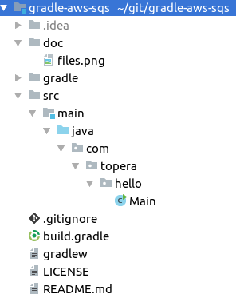

# Topera's Hello World #016
## Amazon Simple Queue Service (AWS SQS)
This example shows how to configure AWS SQS automatically and use it.

## How to test
* Go to AWS console and access IAM (Identity and Access Management).
* Follow their instructions to create a "access key ID" and "secret access key" pair
* In your machine, create this file to config your credentials: `~/.aws/credentials`
* Add there a block like this one, using your keys:
<pre>
[default]
aws_access_key_id = ADSEFDAXFFGFDSDFDSEE
aws_secret_access_key = 5k3jskj4kjk2ldkfje/fdkjfrlkREs/ldsaREAsr
</pre>
* With the steps above we've created a credential called 'default' that will be used to access AWS.
* Now we'll run our Hello World that will create a new Queue in SQS and add 3 messages there
* Run `$ ./gradlew`
* At this point, 3 messages were sent to the queue and 1 was received.
* Now access AWS -> SQS e notice that we have a new queue created, with 2 messages.
* Done!

## Tech Stack
* Intellij IDEA 2018.1
* Java 1.8.0_161
* Gradle 4.7

## Folder Structure

To take a look in other projects, please see https://github.com/topera/index
